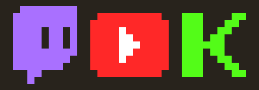

# Stream Chat

Shows live **Twitch**, **YouTube** and **Kick** chat in the RuneScape chatbox, with a per-platform
icon on every line.



```
<twitch>  SomeUser: yo that drop is insane
<kick>    Another_1: KEKW
<youtube> ThirdPerson: gz on the pet
```

Read-only. It never sends anything to a stream, never types in game, and never reads your game chat.

---

## Install

**Plugin Hub** (once merged): RuneLite &rarr; wrench icon &rarr; *Plugin Hub* &rarr; search "Stream Chat".

**Local build:**

```sh
./gradlew build          # compile + tests
./gradlew runClient      # launch RuneLite with the plugin loaded
```

Requires a JDK to build. Java 11 is the target; any JDK 17+ can build it (`options.release = 11`).

---

## Setup

Everything lives under the plugin's config panel, grouped by platform.

### Twitch

1. Tick **Enable Twitch**.
2. Put channel names in **Channels**, comma separated: `odablock, settled`.

That is the whole setup. **No account, login or token is needed.** Twitch accepts anonymous
read-only IRC connections, and still sends display names and name colours, so a token would add
nothing to a read-only feed. Pasted URLs and leading `#`/`@` are tolerated.

**Show subs and raids** additionally prints subscription, gift and raid announcements.

### Kick

1. Tick **Enable Kick**.
2. Put channel slugs in **Channels**: `trainwreckstv, spreen`.

Also no account or token needed.

<details>
<summary>If Kick chat never connects (&ldquo;could not resolve chatroom id&rdquo;)</summary>

Kick's site API sits behind Cloudflare, which sometimes refuses non-browser clients. The chatroom
ID is stable per channel, so you can supply it by hand:

1. Open `https://kick.com/api/v2/channels/<slug>` in your browser.
2. Find `"chatroom": { "id": 123456, ... }`.
3. Put `slug:123456` in **Chatroom IDs**, comma separated for several channels.

Channels listed there skip the lookup entirely.
</details>

### YouTube

YouTube is the one platform that needs a credential, because Google requires one for *all* Data API
calls. You supply your own key, so the quota consumed is yours.

1. Go to the [Google Cloud Console](https://console.cloud.google.com/), create a project.
2. **APIs & Services &rarr; Library &rarr; YouTube Data API v3 &rarr; Enable**.
3. **APIs & Services &rarr; Credentials &rarr; Create credentials &rarr; API key**.
4. Restrict the key to *YouTube Data API v3* (recommended).
5. Paste it into **API key**, and put the live video URL into **Video or channel**.

**Paste the live video URL, not the channel.** This matters a lot:

| Target | API call | Quota cost |
| --- | --- | --- |
| Video URL or ID | `videos.list` | **1 unit** |
| Channel ID or `@handle` | `search.list` + `videos.list` | **101 units** |

A Google project gets **10,000 units/day**. Reading messages costs 5 units per poll, so at the
default 5-second interval you get roughly **2.5 hours of viewing per day**. Raise **Minimum poll
interval** to stretch that further.

If you use a channel/handle target, keep **Offline re-check** high &mdash; every check while the
channel is offline burns another 100 units.

OAuth is deliberately not used: it is only required to read *private/unlisted* broadcasts or to post
messages, and this plugin does neither.

---

## Display and filtering

| Option | Notes |
| --- | --- |
| **Show in** | Which chatbox tab to print to: Game, Channel, Clan or Trade. Channel/Clan keeps stream chat out of your game messages. |
| **Source icon** | The per-platform icon prefix. |
| **Show channel name** | Useful when watching several channels at once. |
| **Colour author names** | Uses the chatter's own colour where the platform sends one. Very dark names are brightened so they stay readable. |
| **Max message length** | Long messages are truncated. |
| **Messages per tick** | Print budget per 0.6s tick. This is the main flood control. |
| **Queue size** | When full, the **oldest** messages are dropped so the chatbox stays live instead of falling behind. |
| **Hide bot commands** | Hides messages starting with `!` or `?`. |
| **Blocked users / words** | Comma separated, case insensitive. |

Type `::streamchat` in game to print the connection status of each platform.

---

## How it handles a busy stream

A popular channel can produce far more messages per second than a chatbox can show. Rather than
letting that push your game messages out of view, incoming messages go through a bounded queue and a
per-tick print budget. When the queue overflows the **oldest** entries are discarded, so what you see
stays close to live, and an occasional `(n messages skipped)` line makes the gap visible rather than
silent.

Reconnection uses exponential backoff capped at five minutes, with jitter so several channels do not
all reconnect in lockstep after an outage. Errors that retrying cannot fix &mdash; a rejected API
key, a suspended channel, exhausted quota &mdash; stop cleanly and say why in `::streamchat` instead
of hammering the service.

## Safety

Stream chat is untrusted text from strangers, and the game chatbox treats `<...>` and `@` as markup.
Left unescaped, a chatter could inject `` to fake a mod crown, `<col=...>` to recolour the
line, or `@...@` colour codes.

Every message goes through `ChatText.clean` (collapse whitespace, drop characters the game font
cannot render, truncate) and then RuneLite's `Text.escapeJagex` before it reaches the chatbox.
Truncation happens *before* escaping so a cut can never land inside a generated `<lt>`. This is
covered by tests in `ChatTextTest`.

## Privacy

- No game data leaves your client. The plugin reads nothing from your account and sends nothing to
  any stream.
- Network connections are only to `irc-ws.chat.twitch.tv`, `ws-us2.pusher.com`, `kick.com` and
  `googleapis.com`.
- Your YouTube API key is stored in your RuneLite config and sent only to `googleapis.com`.
- No credentials are bundled with the plugin.

---

## Development

```sh
./gradlew build          # compile + tests
./gradlew runClient      # RuneLite with the plugin as a builtin
python3 tools/make_icons.py   # regenerate the chat icons
```

The plugin has **no third-party dependencies** &mdash; OkHttp (including its WebSocket client), Gson,
Guava and Guice all come from the RuneLite classpath. This is deliberate: Plugin Hub requires
dependency verification hashes for any added dependency, which significantly extends review.

Icons are 11x11 PNGs. RuneLite's sprite converter draws a pixel **only if it is fully opaque**, so
they are hand-placed pixel art with no antialiasing &mdash; see `tools/make_icons.py`.

### Layout

| Path | Role |
| --- | --- |
| `StreamChatPlugin` | Lifecycle, config wiring, `::streamchat` |
| `MessageRouter` | Filtering, de-duplication, rate limiting, rendering |
| `ChatText` | Sanitising. The security boundary. |
| `ChatIcons` | Registers the source icons, resolves `` indices |
| `AbstractChatSource` | Lifecycle, status, reconnect backoff shared by all sources |
| `twitch/` | IRC-over-WebSocket client + IRCv3 parser |
| `youtube/` | Data API v3 polling + target parsing |
| `kick/` | Pusher chatroom socket |

### Before submitting to the Plugin Hub

- The `author` field is set to `EAS-Andrew`.
- Push to a **public** repo and open a PR against
  [runelite/plugin-hub](https://github.com/runelite/plugin-hub).
